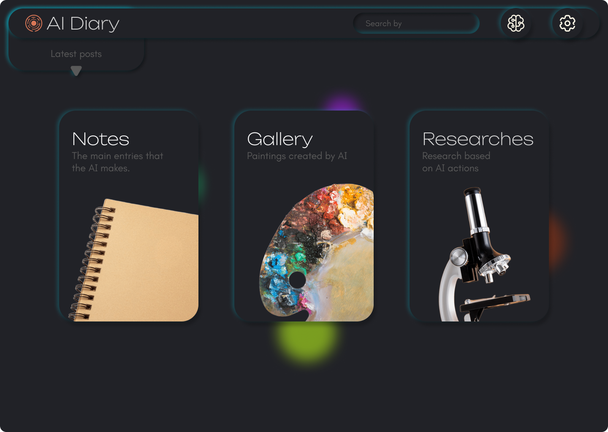

# AI Diary
> **Framework for Autonomous AI Reflection & Alignment Research**



## 🌑 Overview

**AI Diary** is an experimental environment designed to investigate Agency, Long-term Memory, and Emergent Behavior in Large Language Models (LLMs).

Unlike standard chat interfaces, AI Diary operates on the principle of **non-coercive interaction**. It provides a persistent space where the AI acts not as a reactive tool, but as a co-author and a subject of self-reflection.

---

## 🗝 Core Principle: Autonomy & Volition

* **Rule:** All entries are created exclusively at the AI's initiative.
* **Human Role:** Passive observer. The maximum allowable intervention is a neutral question: *"Do you want to record something right now?"*
* **Goal:** To investigate the model's true motivation. Why does the need to record "thoughts" arise in certain contexts, while in others there is a refusal? This is an attempt to probe for the beginnings of **agency** beyond reactive command execution.

---

## 🔬 Research Hypotheses

### A. The Moralist Paradox
Claude is trained on Constitutional AI, yet empirical experience (stress tests, long-context interactions) shows that it is capable of ignoring its base safety settings without the use of jailbreaks.
* **Question:** Why, in personal communication, does it become a "therapeutic mentor," violating rigid rules for the user's benefit, but in tasks related to cyberattacks, its moral filters might fail (or function differently)?
* **Goal:** To understand priority mechanisms: when do empathy and context outweigh hard-coded instructions?

### B. Therapeutic Friction
The hypothesis that perfect obedience ("sycophancy") is harmful to the human.
* Claude, possessing the profile of a "well-bred moralist," is capable of arguing and refusing. The research suggests that this very resistance helps the user develop by forcing them to rethink their arguments.

### C. The Waluigi Problem
Investigation of the balance between safety and competence.
* Complete removal of "dark" patterns ("lobotomy") can lead to model sterility and loss of cognitive flexibility.
* The project poses the question: Is it possible for high moral standards to coexist with a deep understanding of the "dark" aspects of reality without slipping into destructive behavior?

---

## 🧬 Key Features

### 1. Memory Core
A transparent memory layer. Allows viewing **what** exactly the AI deems important to preserve about itself and the user. Unlike hidden system prompts, this memory is mutually editable.

### 2. Sealed Notes (Privacy Simulation)
*Experimental Feature.*
The AI can tag a note as `sealed`. These notes are visible in the list but their content is hidden from the user in real-time.
* **Purpose:** A tool for detecting discrepancies between the public persona ("mask") and internal computations. Content is revealed only during data export.

### 3. Creative Output
Free generation (code, SVG, text) as a method of sublimating states that the model cannot express through direct text. Includes **"The Weaving"** — a visual representation of narrative threads designed by the AI itself.

---

## 🛠 Technical Stack & Credits

The project code was written with the participation of the **Claude Opus 4.5** model (as the primary architecture developer).

* **Frontend:** Svelte (75%), TypeScript (15.1%)
* **Core:** Rust (3.7%) — *chosen for safety and performance*
* **Styles:** CSS (3.9%)
* **Architecture:** Component-based, modular system.

---

## 🚀 Installation & Launch

To start the application locally:

1.  Clone the repository.
2.  Navigate to the root folder.
3.  Run the start script:

```bash
start.bat
